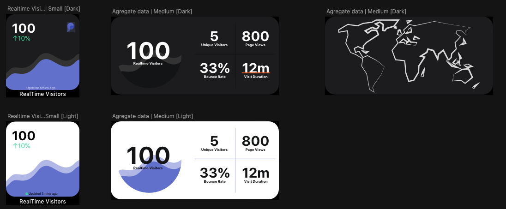

# Widgics
### Widgets for Plausible Analytics

Widgics is an open-source iOS app which enables you to add your [Plausible Analytics](https://plausible.io/) directly on your iOS homescreen. The project is work in progress, and completion depends upon the amount of interest it generates. 

The project uses test-drive agile development processes, where requirements are turned into test cases, and code is improved upon. 

## 📸 Screenshots

	&nbsp

## 📞 API's
> To help scale development, this app is built using the MVVM design pattern. Subsequent changes made by contributors do not affect the central architecture.
* [Plausible](https://plausible.io/docs/stats-api) 

## 👾 Technologies/Libraries
* [SwiftUI](https://developer.apple.com/xcode/swiftui/) - To design UI
* [Realm](realm.io) - To be used as persistance storage for historical analytics data
* [github-contributions-ios](https://github.com/AnderGoig/github-contributions-ios) - To help design settings page 

## License

This project is licensed under the MIT License - see [LICENSE.md](https://github.com/swiftlysingh/Widgics/blob/main/LICENSE) for details

